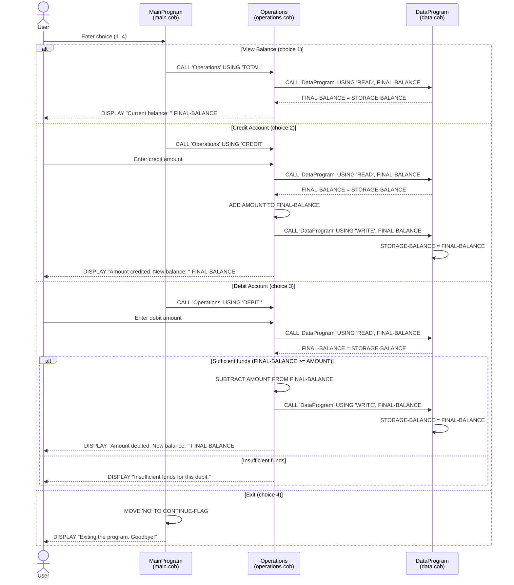

# COBOL Account Management System

## Overview

This system is a legacy COBOL application that manages student account balances. It provides a menu-driven interface for viewing balances and performing credit/debit transactions. The initial account balance is set to **$1,000.00**.

---

## File Descriptions

### `src/cobol/main.cob` — Entry Point (`MainProgram`)

The main program and entry point for the application. It presents a menu loop to the user and delegates work to the `Operations` subprogram based on the user's input.

**Key logic:**
- Continuously displays a menu until the user chooses to exit.
- Accepts a numeric choice (1–4) from the user.
- Calls `Operations` with the appropriate operation code:
  - `1` → `'TOTAL '` (view balance)
  - `2` → `'CREDIT'` (deposit funds)
  - `3` → `'DEBIT '` (withdraw funds)
  - `4` → Sets `CONTINUE-FLAG` to `'NO'`, ending the loop
- Displays an error message for any input outside the range 1–4.

---

### `src/cobol/operations.cob` — Business Logic (`Operations`)

Handles the three core account operations. Called by `MainProgram` with a 6-character operation code. Interacts with `DataProgram` to read and write the balance.

**Key logic:**

| Operation Code | Description |
|---|---|
| `TOTAL ` | Reads and displays the current balance |
| `CREDIT` | Prompts for an amount, reads current balance, adds the amount, and writes the new balance |
| `DEBIT ` | Prompts for an amount, reads current balance, subtracts if funds are sufficient, and writes the new balance |

**Business rules:**
- **Insufficient funds check:** A debit is only processed if `FINAL-BALANCE >= AMOUNT`. If not, the transaction is rejected with the message: `"Insufficient funds for this debit."`
- Operation codes are exactly 6 characters. `TOTAL` and `DEBIT` include a trailing space to pad to 6 characters (`'TOTAL '`, `'DEBIT '`).

---

### `src/cobol/data.cob` — Data Layer (`DataProgram`)

Acts as an in-memory data store for the account balance. Accepts a 6-character operation code and a balance value via the `LINKAGE SECTION`.

**Key logic:**

| Operation Code | Description |
|---|---|
| `READ  ` | Copies `STORAGE-BALANCE` into the passed `BALANCE` variable |
| `WRITE ` | Copies the passed `BALANCE` value into `STORAGE-BALANCE` |

**Business rules:**
- The default/initial account balance is **$1,000.00** (`STORAGE-BALANCE PIC 9(6)V99 VALUE 1000.00`).
- Balance is stored as a packed decimal with 6 integer digits and 2 decimal places, supporting values up to **$999,999.99**.
- Data is held in working storage only; **no persistent file or database storage** is used. All data is lost when the program exits.

---

## Data Flow

```
MainProgram (main.cob)
    │
    │  CALL 'Operations' USING <operation-code>
    ▼
Operations (operations.cob)
    │
    │  CALL 'DataProgram' USING 'READ'/'WRITE', <balance>
    ▼
DataProgram (data.cob)
```

---

## Business Rules Summary

| Rule | Detail |
|---|---|
| Initial balance | $1,000.00 |
| Maximum balance | $999,999.99 |
| Overdraft prevention | Debit transactions are rejected if the requested amount exceeds the current balance |
| No persistence | Account balance resets to the initial value on each program run |
| Input validation | Menu input outside 1–4 displays an error; no validation is performed on the amount entered for credit/debit |

---

## Sequence Diagram


